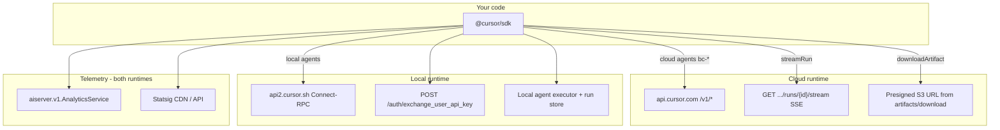

# `@cursor/sdk` external API analysis

Analysis of **`@cursor/sdk@1.0.13`** (installed in this repo) compared to the **[Cloud Agents REST API v1](https://cursor.com/docs/cloud-agent/api/endpoints)** and **[OpenAPI spec](https://cursor.com/docs-static/cloud-agents-openapi.yaml)**.

The SDK bundles minified JavaScript; paths and methods below were recovered from `dist/esm/index.js`, `dist/esm/cloud-api-client.d.ts`, and Connect/protobuf service definitions embedded in the bundle.

---

## Architecture overview

The SDK exposes one programming model (`Agent`, `Run`, `Cursor.*`) over **two runtimes**:

| Runtime | Where work runs | Primary external I/O |
| --- | --- | --- |
| **Cloud** | Cursor-hosted VM (or self-hosted pool/machine via `env`) | **REST** `https://api.cursor.com/v1/*` via `CloudApiClient` |
| **Local** | Caller machine (`cwd`) | **Connect-RPC** (HTTP/1.1) to `https://api2.cursor.sh` via `agent.v1.AgentService` and related services; plus local subprocess / SQLite run store |

---

## Base URLs and environment variables

| Variable | Default | Used for |
| --- | --- | --- |
| `CURSOR_API_KEY` | — | API key for REST and RPC (also overridable per call via `apiKey`) |
| `CURSOR_BACKEND_URL` | `https://api.cursor.com` | Cloud REST base URL (`CloudApiClient` constructor) |
| `CURSOR_API_BASE_URL` | `https://api2.cursor.sh` | Auth token exchange and some login/privacy flows |
| `CURSOR_CLOUD_AGENT_USE_LOCAL_NON_VM` | — | When `true` and backend is localhost, adds header `x-background-composer-local-use-non-vm: true` (dev only) |

**Note:** Cloud agents use **`api.cursor.com`**. Local agent inference and dashboard-style RPCs use **`api2.cursor.sh`**. The auth exchange endpoint lives on the `CURSOR_API_BASE_URL` host.

---

## Part 1 — Cloud Agents REST API (`CloudApiClient`)

Implementation: class `CloudApiClient` in the bundle (typed in `cloud-api-client.d.ts`).

- **Transport:** `fetch()`
- **Auth:** `Authorization: Bearer <CURSOR_API_KEY>` (REST also supports Basic in docs; SDK uses Bearer only)
- **Common headers:**
  - `x-ghost-mode` — privacy/telemetry mode (resolved per API key)
  - `x-cursor-client-version` — SDK version string
  - `x-cursor-client-type: sdk`
  - `Content-Type: application/json` (when body present)
  - `Idempotency-Key` (optional, on create agent / create run)
  - `x-cursor-streaming: true` (on SSE `streamRun`)
  - `Last-Event-ID` (on stream resume)

### Endpoint mapping (SDK → REST)

| SDK method | HTTP | Path | REST doc operation |
| --- | --- | --- | --- |
| `createAgent` | `POST` | `/v1/agents` | [Create an agent](https://cursor.com/docs/cloud-agent/api/endpoints#create-an-agent) |
| `getAgent` | `GET` | `/v1/agents/{id}` | [Get an agent](https://cursor.com/docs/cloud-agent/api/endpoints#get-an-agent) |
| `listAgents` | `GET` | `/v1/agents` | [List agents](https://cursor.com/docs/cloud-agent/api/endpoints#list-agents) |
| `archiveAgent` | `POST` | `/v1/agents/{id}/archive` | [Archive an agent](https://cursor.com/docs/cloud-agent/api/endpoints#archive-an-agent) |
| `unarchiveAgent` | `POST` | `/v1/agents/{id}/unarchive` | [Unarchive an agent](https://cursor.com/docs/cloud-agent/api/endpoints#unarchive-an-agent) |
| `deleteAgent` | `DELETE` | `/v1/agents/{id}` | [Delete an agent permanently](https://cursor.com/docs/cloud-agent/api/endpoints#delete-an-agent-permanently) |
| `createRun` | `POST` | `/v1/agents/{id}/runs` | [Create a run](https://cursor.com/docs/cloud-agent/api/endpoints#create-a-run) |
| `listRuns` | `GET` | `/v1/agents/{id}/runs` | [List runs](https://cursor.com/docs/cloud-agent/api/endpoints#list-runs) |
| `getRun` | `GET` | `/v1/agents/{id}/runs/{runId}` | [Get a run](https://cursor.com/docs/cloud-agent/api/endpoints#get-a-run) |
| `cancelRun` | `POST` | `/v1/agents/{id}/runs/{runId}/cancel` | [Cancel a run](https://cursor.com/docs/cloud-agent/api/endpoints#cancel-a-run) |
| `streamRun` | `GET` | `/v1/agents/{id}/runs/{runId}/stream` | [Stream a run](https://cursor.com/docs/cloud-agent/api/endpoints#stream-a-run) (SSE) |
| `listArtifacts` | `GET` | `/v1/agents/{id}/artifacts` | [List artifacts](https://cursor.com/docs/cloud-agent/api/endpoints#list-artifacts) |
| `getArtifactDownloadUrl` | `GET` | `/v1/agents/{id}/artifacts/download?path=...` | [Download an artifact](https://cursor.com/docs/cloud-agent/api/endpoints#download-an-artifact) |
| `getMe` | `GET` | `/v1/me` | [API key info](https://cursor.com/docs/cloud-agent/api/endpoints#api-key-info) |
| `listModels` | `GET` | `/v1/models` | [List models](https://cursor.com/docs/cloud-agent/api/endpoints#list-models) (metadata) |
| `listRepositories` | `GET` | `/v1/repositories` | [List repositories](https://cursor.com/docs/cloud-agent/api/endpoints#list-repositories) |

### How cloud `Agent` maps to REST calls

| User-facing SDK flow | REST sequence |
| --- | --- |
| `Agent.create({ cloud: ... })` + first prompt | `POST /v1/agents` (agent + initial run in one response) |
| `agent.send(...)` (follow-up) | `POST /v1/agents/{id}/runs` |
| `run.stream()` / `run.messages()` | `GET /v1/agents/{id}/runs/{runId}/stream` (SSE); may reconnect with `Last-Event-ID` |
| `run.wait()` | Poll/stream until terminal; uses `GET .../runs/{runId}` for status/result |
| `run.cancel()` | `POST .../runs/{runId}/cancel` |
| `Agent.resume("bc-...")` | `getAgent` + subsequent `createRun` (no separate “resume” endpoint) |
| `Agent.get` / `Agent.list` (cloud) | `GET /v1/agents/{id}` / `GET /v1/agents` |
| `Cursor.models.list()` (cloud path) | `GET /v1/models` |
| `Cursor.repositories.list()` | `GET /v1/repositories` |
| `Cursor.me()` | `GET /v1/me` |
| `agent.listArtifacts()` / `downloadArtifact()` | `GET .../artifacts` then `GET .../artifacts/download` → client may `fetch` the returned presigned URL |

### Request body alignment (`V1*` types vs REST)

`cloud-api-client.d.ts` mirrors the OpenAPI shapes:

| Field area | SDK type | REST | Notes |
| --- | --- | --- | --- |
| Prompt | `V1Prompt` (`text`, `images`) | `prompt.text`, `prompt.images` | Aligned |
| Model | `ModelSelection` | `model.id`, `model.params` | Aligned |
| Repos | `V1Repository[]` | `repos[]` | `startingRef` in SDK matches `startingRef` in API |
| Env | `V1Env` | `env.type`, `env.name` | `cloud` / `pool` / `machine` |
| MCP | `V1McpServer[]` | `mcpServers[]` | SDK rejects `cwd` on stdio MCP for cloud |
| Subagents | `V1CustomSubagent[]` | `customSubagents[]` | Aligned |
| Session secrets | `envVars` | `envVars` | Aligned; cannot combine with client `agentId` per API |
| Idempotent create | `agentId`, `idempotencyKey` | Same | Aligned |

### SDK vs REST — gaps and differences

| Topic | REST API | `@cursor/sdk` (v1.0.13) |
| --- | --- | --- |
| **`mode` (`agent` / `plan`)** | Supported on create and follow-up runs | **Not** in `V1CreateAgentRequest`, `V1CreateRunRequest`, or public `SendOptions` — plan/agent mode not exposed in typed cloud client |
| **Authentication style** | Basic (`-u KEY:`) or Bearer | Bearer only |
| **Create response** | `201` + `{ agent, run }` | Same shape consumed by SDK |
| **Stream events** | SSE: `status`, `assistant`, `thinking`, `tool_call`, `interaction_update`, `heartbeat`, `result`, `error`, `done` | SDK parses into `SDKMessage` / `InteractionUpdate` types |
| **Error codes** | Structured `error.code` (e.g. `agent_busy`, `integration_not_connected`) | Mapped to `CursorAgentError` subclasses (`AgentBusyError`, `IntegrationNotConnectedError`, etc.) |
| **Resume** | N/A (durable agent + new run) | `Agent.resume(id)` reattaches; MCP must be passed again on resume |
| **Sub-tokens** | `POST /v1/sub-tokens` | **Not called** by SDK |
| **Fleet / v0 workers** | `/v0/private-workers/*` | **Not called** by SDK |
| **Webhooks** | Documented as coming soon (v0 legacy) | **Not used** |

---

## Part 2 — Local runtime (non–Cloud Agents REST)

Local agents do **not** use `/v1/agents`. They talk to Cursor backends over **Connect-RPC** (protobuf services) and run tooling on disk.

### Auth: API key → access token

| Call | Method | URL | Purpose |
| --- | --- | --- | --- |
| Exchange user API key | `POST` | `{CURSOR_API_BASE_URL}/auth/exchange_user_api_key` | Body `{}`; returns `accessToken` + `refreshToken` for subsequent RPC |

Default `CURSOR_API_BASE_URL`: `https://api2.cursor.sh`.

### Connect-RPC services (host: `CURSOR_BACKEND_URL` or `https://api2.cursor.sh`)

Transport: `@connectrpc/connect-node` with `httpVersion: "1.1"`. If `baseUrl` ends with `cursor.sh`, traffic is routed to `https://api2.cursor.sh`.

#### `agent.v1.AgentService` — core local agent loop

| RPC method | Kind | SDK usage |
| --- | --- | --- |
| `Run` | BiDi streaming | **Primary** — local prompt execution |
| `RunSSE` | Server streaming | Available in proto; alternate streaming path |
| `RunPoll` | Server streaming | Polling variant |
| `NameAgent` | Unary | Naming |
| `UpdateConversationMetadata` | Unary | Metadata |
| `CreateTranscriptOverview` | Unary | Transcript |
| `GetUsableModels` | Unary | Model catalog (local) |
| `GetDefaultModelForCli` | Unary | Default model |
| `GetAllowedModelIntents` | Unary | Intent allowlist |
| `UploadConversationBlobs` | Unary | Blob upload |
| `NotifyConversationClone` | Unary | Clone notification |
| `GetNewChatNudgeLegacyModelPicker` | Unary | UI/nudge (likely incidental) |
| `GetNewChatNudgeParameterizedModelPicker` | Unary | UI/nudge (likely incidental) |

**Observed invocations in bundle:** `.run(` on the agent client (BiDi stream).

#### `aiserver.v1.AnalyticsService` — SDK telemetry

| RPC method | SDK usage |
| --- | --- |
| `trackEvents` | **Used** — `sdk.run.created`, `sdk.run.completed`, `sdk.run.send_latency`, `sdk.executor.startup` |
| `bootstrapStatsig` | Statsig initialization |
| `getFirstWindowStatsigDecision` | Feature gates |
| `batch`, `submitLogs`, `ingestConversation`, `uploadIssueTrace`, `downloadIssueTraces` | Defined in proto; not primary SDK path |

Default analytics backend: `https://api2.cursor.sh` (via `createClient(AnalyticsService, transport)`).

#### `aiserver.v1.DashboardService` — plugins / skills

Large surface area in protobuf; **SDK only invokes:**

| RPC method | Purpose |
| --- | --- |
| `getManagedSkills` | Load managed agent skills at local executor startup |
| `getEffectiveUserPlugins` | Marketplace plugins for local runtime |

### Privacy / ghost mode

Before cloud requests, the SDK calls `ensureGhostModeHeaderForApiKey()` to set `x-ghost-mode` from a cached **privacy mode** (protobuf `aiserver.v1.PrivacyMode`), refreshed in the background with configurable cache age (`CURSOR_PRIVACY_CACHE_MAX_AGE_MS`, default 1 hour).

### Local-only infrastructure (not HTTP to Cursor product API)

Bundled via `@anysphere/cursor-sdk-local-runtime` and related packages:

- Local **agent executor** subprocess (platform-specific optional deps: `@cursor/sdk-darwin-arm64`, etc.)
- **SQLite** run store on disk
- **Sandbox** helpers, `rg` (ripgrep), shell/MCP execution locally
- Optional **GitHub** `api.github.com` for repo operations (tooling, not Cursor API)

---

## Part 3 — Third-party and auxiliary HTTP

| Target | When | Notes |
| --- | --- | --- |
| `https://api.statsigcdn.com/v1` | Local executor bootstrap | `@statsig/js-client` feature gates / dynamic config |
| `https://featureassets.org/v1` | Statsig asset delivery | Config assets |
| `https://statsigapi.net/v1/sdk_exception` | Statsig error reporting | Telemetry |
| `https://api.github.com` | Git/tooling | Not Cursor Cloud Agents API |
| `https://cloudflare-dns.com/dns-query` | Network allowlist / DNS checks | Sandbox networking |
| Presigned S3 URL from `artifacts/download` | `agent.downloadArtifact()` | **Second hop** after Cursor REST; URL host is AWS S3, not `api.cursor.com` |

---

## Part 4 — REST endpoints **not** used by `@cursor/sdk`

These exist in the [Cloud Agents API docs](https://cursor.com/docs/cloud-agent/api/endpoints) but have **no** `CloudApiClient` wrapper in v1.0.13:

| Endpoint | Purpose |
| --- | --- |
| `POST /v1/sub-tokens` | User-scoped worker tokens (My Machines) |
| `GET /v0/private-workers` | Self-hosted pool worker list |
| `GET /v0/private-workers/summary` | Fleet utilization |
| `GET /v0/private-workers/{id}` | Single worker |
| `GET /v0/private-workers/pending-requests` | Pending pool requests |
| Legacy [v0 Cloud Agents API](https://cursor.com/docs/cloud-agent/api/v0.md) | Flatter agent model, webhooks |

Use raw `fetch` / `curl` against `https://api.cursor.com` if you need these from Node without extending the SDK.

---

## Part 5 — Error handling comparison

| Layer | Behavior |
| --- | --- |
| **REST (`CloudApiClient`)** | HTTP status → typed errors: `401` → `AuthenticationError`, `429` → `RateLimitError`, `409` + `agent_busy` → `AgentBusyError`, `integration_not_connected` → `IntegrationNotConnectedError`, 5xx → retryable `NetworkError` |
| **Run finished with failure** | `result.status === "error"` (run executed but failed) — distinct from thrown `CursorAgentError` (run never started) |
| **SSE stream** | `410 stream_expired` per docs; SDK should fall back to `getRun` |
| **Local RPC** | Connect errors + same conceptual split between transport failures and run-level errors |

---

## Summary table: “which API should I use?”

| Goal | Use |
| --- | --- |
| Automate cloud agents from TypeScript with streaming | `@cursor/sdk` cloud runtime (wraps REST v1) |
| Same as above from Rust / Go / curl | Cloud Agents REST directly |
| Run agent against **local checkout** | `@cursor/sdk` local runtime (Connect-RPC + local executor) |
| CI on repo already checked out | SDK **local** or cloud with `repos` |
| Fire-and-forget long jobs, PRs on GitHub | SDK **cloud** |
| Worker tokens / pool fleet scaling | REST only (not in SDK) |

---

## References

- SDK package: `@cursor/sdk@1.0.13` — [TypeScript SDK docs](https://cursor.com/docs/sdk/typescript)
- Cloud Agents REST: [Endpoints](https://cursor.com/docs/cloud-agent/api/endpoints), [OpenAPI](https://cursor.com/docs-static/cloud-agents-openapi.yaml)
- API overview (auth, rate limits): [cursor.com/docs/api](https://cursor.com/docs/api)

*Generated from static analysis of the installed npm package in this repository (May 2026).*
